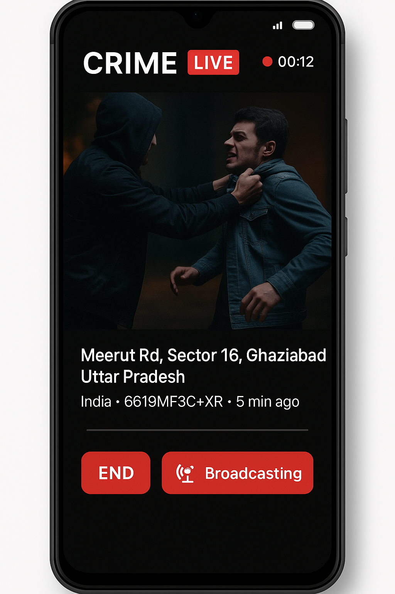

# Rakshak Live (Proposed)

**India’s First Government-Controlled Real-Time Crime Livestream and Emergency Response System**

**Rakshak Live** is a proposed national security platform that enables any Aadhaar-verified citizen to instantly livestream crimes or emergencies directly to local law enforcement authorities. The system is designed to operate entirely under government control, providing police with real-time visual evidence, geolocation data, facial recognition support, and device-level forensic logs—all stored immutably and accessed exclusively by authorized agencies.

---

## Why This Matters

India’s current emergency response systems are limited by delayed reporting, lack of real-time evidence, and insufficient digital infrastructure. Rakshak Live bridges these gaps by enabling:

* Real-time video reporting directly from the scene of the crime
* Immediate alerting of nearby police control rooms and units
* Precise GPS and landmark tagging for rapid response
* Automatic suspect identification using government databases
* Background logging of nearby mobile devices for post-crime investigation
* Immutable evidence storage, even if the victim is incapacitated or the phone is damaged

---

## Core Functional Features

**Livestream Activation**
Citizens can initiate a secure, live video feed with one tap. The stream is pushed instantly to the nearest police control center.

**Location and Landmark Overlay**
GPS coordinates and nearby landmark names are automatically displayed on the stream interface, aiding officers in identifying the exact location of the incident.

**Police Routing**
The app provides real-time routing instructions for the nearest law enforcement units, ensuring optimized travel time to the incident site.

**Facial Recognition (Authority Only)**
Suspects captured in the livestream are processed using facial recognition, matching faces against UIDAI, CCTNS, and FIR records. Identity matches are tagged for immediate action.

**Conditional Public Broadcast**
If facial recognition fails to identify a suspect, police can manually edit and publish clips of the stream through official government social media handles, requesting public assistance in identification. Victim identities are automatically anonymized.

**Silent Digital Witness Logging**
The app detects and logs nearby devices using Bluetooth, Wi-Fi, and network signals. IMEI numbers, MAC addresses, and signal strength are recorded to assist in later investigations. Identity matching is done exclusively through telco partnerships under lawful authorization.

**Immutable Evidence Storage**
All video and metadata are stored in real time on government-owned cloud infrastructure (e.g., NIC Cloud, MeghRaj). Data is encrypted, tamper-proof, and admissible in court.

**Access Control and Verification**
Only Aadhaar-verified users can activate the system. All data is accessible only by law enforcement officials. There is no private or third-party data access.

**Anti-Misuse Mechanism**
False alerts are detected via AI-assisted pattern analysis and manual review. Misuse results in an automated fine of ₹10,000 or temporary police detention. Repeat offenders are permanently banned.

---

## Technical Architecture (Proposed)

| Component          | Technology/Service                                 |
| ------------------ | -------------------------------------------------- |
| Mobile App         | Android (Kotlin/Java), WebRTC                      |
| Location Services  | Google Maps SDK or ISRO Bhuvan                     |
| Backend            | Spring Boot / Node.js                              |
| Cloud Storage      | NIC/MeghRaj (Government cloud), real-time chunking |
| Admin Dashboard    | ReactJS with TailwindCSS                           |
| Facial Recognition | OpenCV, AWS Rekognition (Gov-authorized access)    |
| Identity APIs      | Aadhaar, CCTNS, SIM-KYC via DoT                    |

---

## Legal and Operational Compliance

* All surveillance features comply with **Section 69 of the IT Act** for lawful interception.
* Evidence storage aligns with the **Indian Evidence Act** to ensure admissibility in court.
* Identity tracing through device logs is conducted via **official requests to telecom operators** under CrPC authorizations.
* User KYC is mandatory. Anonymous usage is not permitted.
* Social media publishing is only executed through **verified government handles** under officer supervision.

---

## Status: Under Proposal

Rakshak Live is currently a proposed system intended for pilot implementation in partnership with:

* **Ministry of Home Affairs (MHA)** – For deployment, oversight, and national scale-up
* **Ministry of Electronics and Information Technology (MeitY)** – For UID/IMEI database access, e-challan integration, and Play Store support
* **Smart City Mission** – For on-ground implementation in select urban zones
* **State Police Departments** – For dashboard integration and training

Initial pilot cities: **Delhi, Pune, Indore** (subject to approval)

---

## App Preview

The following is a conceptual mockup of the Rakshak Live interface during a crime-stream activation:

---

## Contribution and Feedback

This repository serves as the foundation for a potential civic-tech infrastructure to be operated exclusively by the Government of India. If you are a policymaker, law enforcement professional, public safety researcher, or infrastructure partner interested in contributing to this concept, please reach out or raise a formal issue in the repository.
